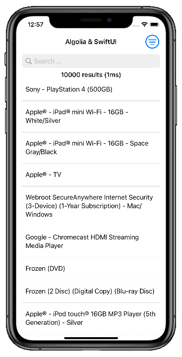

# InstantSearch iOS Example

This project demonstrates how to integrate InstantSearch iOS into your application.

  

## Features

- Basic search functionality
- Facets filtering

## Getting Started

1. Clone this repository.
2. Open `InstantSearchExample.xcodeproj` in Xcode.
3. Run the app on a simulator or device.

## Usage

- Enter a search query in the search bar to see instant results.
- Use facet filters to refine your search.
